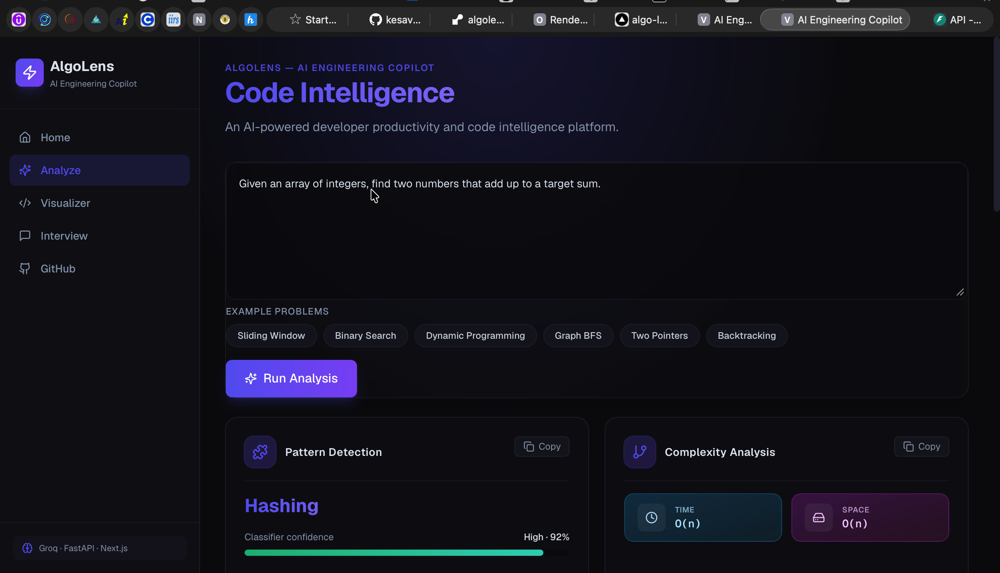
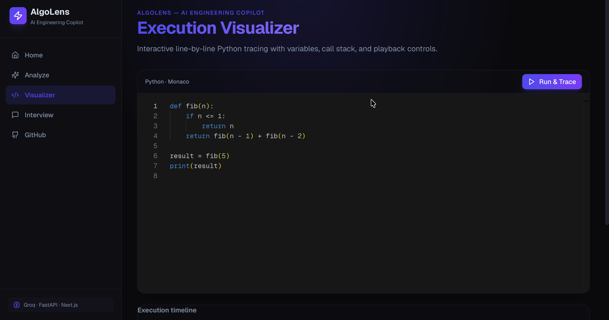
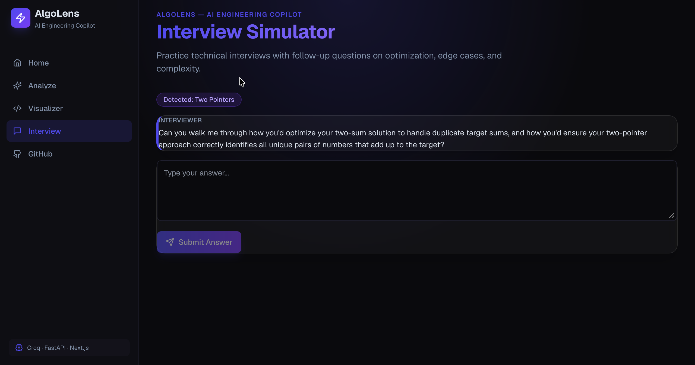
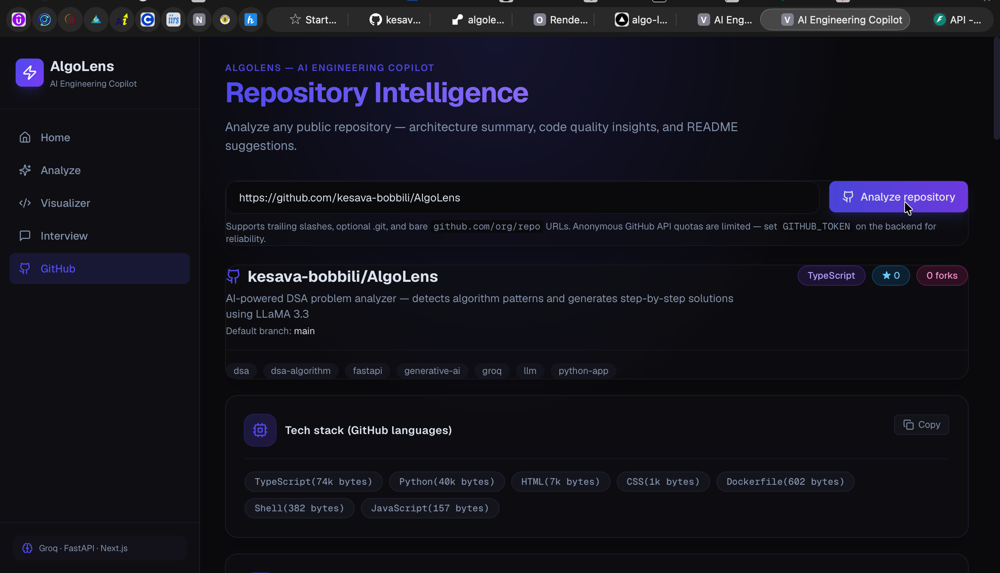
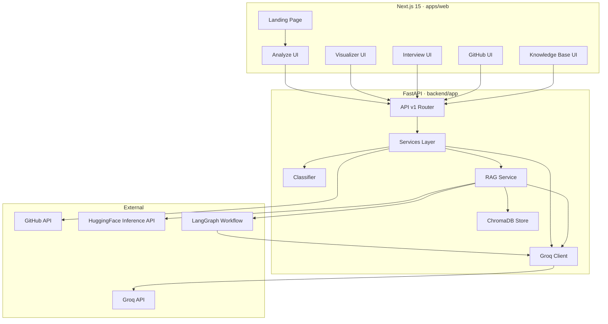

# AlgoLens — AI Engineering Copilot

<p align="center">
  <strong>An AI-powered developer productivity and code intelligence platform.</strong>
</p>

<p align="center">
  Pattern detection · Execution visualization · Interview simulation · GitHub analysis · RAG knowledge base
</p>

<p align="center">
  
  
  
  
  
</p>

---

## Demo

| Analyze | Visualizer | Interview | GitHub |
|---------|------------|-----------|--------|
|  |  |  |  |

🌐 **Live demo:** [algo-lens-gilt.vercel.app](https://algo-lens-gilt.vercel.app)

> Or run locally — see [Setup](#setup) below.

---

## Features

- **Code Intelligence** — Keyword classifier + Groq LLM for approach, pseudocode, optimizations, and edge cases
- **Execution Visualizer** — Line-by-line Python tracing with Monaco, playback controls, variables, and call stack
- **Interview Simulator** — Multi-turn mock interviews with scored feedback
- **GitHub Analyzer** — Public repo structure, README, and AI architecture review
- **RAG Knowledge Base** — Upload notes, PDFs, docs, slides, sheets, and code files for semantic retrieval, grounded answers, and similar-problem search
- **LangGraph Orchestration** — Retrieval → relevance grading → generation pipeline with intelligent fallback handling

---

## Architecture



### Project structure

```
AlgoLens/
├── apps/web/                 # Next.js frontend
│   ├── app/
│   │   ├── page.tsx          # Landing page
│   │   └── (dashboard)/      # App routes (sidebar layout)
│   ├── components/           # UI + feature components
│   └── lib/                  # API client, brand, examples
├── backend/app/
│   ├── api/v1/               # REST endpoints
│   ├── core/                 # Pattern classifier
│   ├── llm/                  # Prompts + Groq client
│   └── services/             # Business logic, including RAG pipeline
├── scripts/                  # Dev scripts
├── render.yaml               # Render deployment
└── docker-compose.yml
```

---

## Tech stack

| Layer | Technologies |
|-------|----------------|
| Frontend | Next.js 15, React 19, TypeScript, Tailwind CSS, Framer Motion |
| Editor | Monaco Editor |
| Charts | Recharts |
| Backend | FastAPI, Pydantic, httpx |
| AI | Groq (LLaMA 3.3 70B), LangChain text splitters, HuggingFace embeddings API |
| Orchestration | LangGraph stateful RAG workflow with relevance grading |
| Vector Search | ChromaDB (in-memory for deployment, persistent locally) |

---

## Setup

### Prerequisites

- Python 3.9+
- Node.js 20+ and npm
- [Groq API key](https://console.groq.com/)

### Backend

```bash
git clone https://github.com/kesava-bobbili/AlgoLens.git
cd AlgoLens
python3 -m venv venv
source venv/bin/activate
pip install -r requirements.txt
cp .env.example .env
# Edit .env → set GROQ_API_KEY and HF_TOKEN
./scripts/dev-backend.sh
```

API: http://localhost:8000 · Docs: http://localhost:8000/docs

### Frontend

```bash
cd apps/web
cp .env.local.example .env.local
npm install
npm run dev
```

App: http://localhost:3000

---

## API overview

| Method | Endpoint | Description |
|--------|----------|-------------|
| `GET` | `/` | Health check |
| `POST` | `/api/v1/analyze` | Analyze coding problem |
| `GET` | `/api/v1/patterns` | List DSA patterns |
| `POST` | `/api/v1/visualize/trace` | Python execution trace |
| `POST` | `/api/v1/interview/start` | Start mock interview |
| `POST` | `/api/v1/interview/respond` | Submit answer |
| `POST` | `/api/v1/github/analyze` | Analyze GitHub repo |
| `POST` | `/api/v1/knowledge/ingest` | Upload and index knowledge files |
| `POST` | `/api/v1/knowledge/query` | Ask a RAG-grounded question |
| `POST` | `/api/v1/knowledge/similar` | Retrieve semantically similar problem/context chunks |
| `GET` | `/api/v1/knowledge/stats` | Inspect vector store chunk count |

---

## Environment variables

| Variable | Where | Required | Description |
|----------|-------|----------|-------------|
| `GROQ_API_KEY` | Backend `.env` | Yes | Groq API key |
| `HF_TOKEN` | Backend `.env` | Yes | Free [HuggingFace token](https://huggingface.co/settings/tokens) for embeddings |
| `GITHUB_TOKEN` | Backend `.env` | No | GitHub API rate limits |
| `CORS_ALLOW_ALL` | Backend `.env` | No | `true` for local dev |
| `CHROMA_PERSISTENT` | Backend `.env` | No | `true` for local persistent vector DB (default: in-memory) |
| `NEXT_PUBLIC_API_URL` | `apps/web/.env.local` | Yes | Backend URL |

---

## Deployment

Frontend → [Vercel](https://vercel.com) · Backend → [Render](https://render.com)

1. Deploy backend to Render using `render.yaml`
2. Set `GROQ_API_KEY` and `HF_TOKEN` in Render environment variables
3. Deploy `apps/web` to Vercel
4. Set `NEXT_PUBLIC_API_URL` in Vercel to your Render URL

---

## Roadmap

- [x] RAG knowledge base with ChromaDB, HuggingFace embeddings, source chunks, and similar-problem search
- [x] LangGraph orchestration workflow with relevance grading and fallback
- [ ] Streaming LLM responses (SSE)
- [ ] Redis-backed interview sessions
- [ ] User accounts & analysis history
- [ ] CI/CD with GitHub Actions
- [ ] Light mode theme

---

## Resume bullet

Built a RAG-based learning assistant in AlgoLens using FastAPI, LangChain, LangGraph, ChromaDB, HuggingFace embeddings API, and Groq LLM APIs — implementing document ingestion, semantic retrieval, relevance grading, grounded answer generation with source citations, fallback handling, and similar-problem search.

---

## License

MIT

---

<p align="center">Built with Groq · FastAPI · LangChain · LangGraph · ChromaDB · Next.js</p>